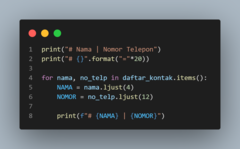
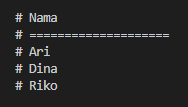

| # | Biodata |
| -------- | --- |
| **Nama** | M. Hannata Zahri |
| **NIM** | 312010318 |
| **Kelas** | TI.20.A.2 |
| **Mata Kuliah** | Bahasa Pemrograman |

---

## Latihan 1
* ### Membuat **Dictionary** daftar kontak, dengan nama sebagai "key" dan nomor sebagai "value"!!
+ 

* ### Menampilkan hasil output **Dictionary** `daftar_kontak`:
+ 

* ### Menambahkan kontak baru dengan nama "Riko" dengan nomor telepon "087654544"!!
+ 
* ### Hasilnya:
+ 

* ### Mengubah kontak "Dina" dengan nomor baru "088999776"
+ 
* ### Hasilnya:
+ 

* ### Menampilkan semua nama atau semua nomor!! Di karenakan saya menggunakan perulangan `for`, maka saya hanya perlu menghapus salah satu string dari **nama** ataupun **nomor**. Syntax-nya:
+ 

* ### Contoh syntax dan hasil untuk menampilkan **nomor** saja:
+ 
+ 

* ### Contoh syntax dan hasil untuk menampilkan **nama** saja:
+ 
+ 

* ### Menghapus kontaknya "Dina", dengan menggunakan syntax sebagai berikut:
+ 
* ### Hasil output sebelum dihapus:
+ 
* ### Hasil output sesudah dihapus:
+ 

* ### Berikut semua syntax program yang saya buat:
```python
daftar_kontak = {
    "Ari" : "081267888",
    "Dina" : "087677776"
}

daftar_kontak.update({"Riko" : "087654544"})
daftar_kontak.update({"Dina" : "088999776"})
del daftar_kontak["Dina"]

print("# Nama | Nomor Telepon")
print("# {}".format("="*20))

for nama, no_telp in daftar_kontak.items():
    NAMA = nama.ljust(4)
    NOMOR = no_telp.ljust(12)

    print(f"# {NAMA} | {NOMOR}")
```
